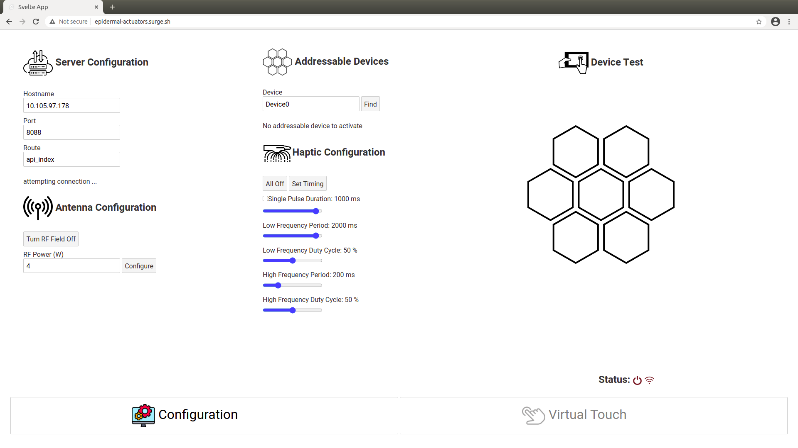
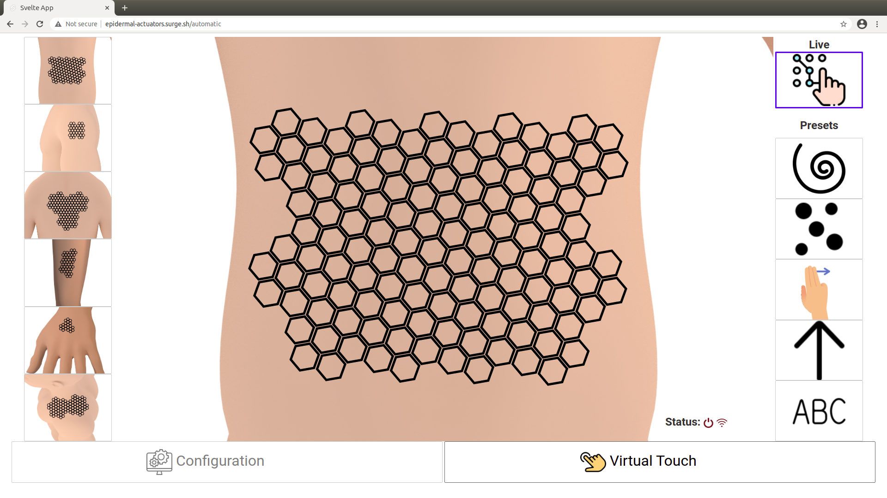

# Epidermal Actuators UI in Svelte

This user interface is designed to be used to control the haptic epidermal actuator devices being developed by the Roger's Research Group at Northwestern University. For a higher level description and demonstrations of the Epidermal Actuators UI project, visit [this post](https://rschloen.github.io/portfolio/2020/12/10/haptic-vr.html).





---


## Get started
Visit the live deployment of the UI [here](epidermal-actuators.surge.sh).

Or to build locally...

Install the dependencies...
*Note that you will need to have [Node.js](https://nodejs.org) installed.*
```bash
cd epidermal-actuators-ui
npm install
```

...then start [Rollup](https://rollupjs.org):

```bash
npm run dev
```

Navigate to [localhost:5000](http://localhost:5000). You should see the app running. Edit a component file in `src`, save it, and reload the page to see your changes.


## Using GUI
To control the physical haptic devices, the GUI needs to be connected to the [protocol host](https://github.com/qsib-cbie/protocol-host-rs) which handles the communication to the device.
### Configurations
On this page you can control the settings for the various aspects of the device setup.

#### Server Configuration
- Change fields for hostname (IP), port, and route to establish a connection to the protocol host computer through zmq. See [https_zmq_server_rs](https://github.com/qsib-cbie/http-zmq-server-rs) and [zmq_cli_rs](https://github.com/qsib-cbie/zmq-cli-rs) for code related to routing with zmq.
  - Ex: If same computer is used for GUI and protocol host, use hostname: localhost. If another computer is used for protocol host, use the protocol host computer's IP.
#### Antenna Configuration
  - Set the power of the NFC antenna used to communicate with the devices.
  - Send command to turn on/off the antenna's RF field

#### Addressable devices
  - Add device(s) to connect to whichever device is in the antenna's field. Devices must be given unique names
  - Remove connected devices
  - If multiple devices added, you can select which one to make active
  
#### Timing configuration
  - Use sliders to set desired timings and press `Set Timing` button to set the timings on the connected device.
  - Use checkbox to switch between continuous and single pulse modes

#### Device Test
  - Hexagons mirror a small portion of the connected full device
  - Used to test timings and other settings before switching to main array of hexagons in the Virtual Touch page.


## Virtual touch

This page contains the main interface for interacting with the connected devices. Using a touch screen, move you finger(s) across the hexagons to activate the haptic actuators on the connected device. Multiple touch points are accepted.

#### Body Location Options
Several device designs, shown with their corresponding placement on the body, can be selected from the buttons on the left to be shown in the center. 

#### Preset Options
By defualt, the UI is in Live, or manual, mode which lets user turn on actuators by touching them. Presets, preprogrammed sequences of active actuators, can be selected from the buttons on the right and triggered with touch gestures on the central array. The presets use the same timing as the Live mode, which can be controlled under Timing Configuration on the Configuration page. The preset activation is accompanied by a visual display of the preset on the GUI. 
    
Currently only the sweep preset for the design on the upper arm is fully implemented in the latest version of the GUI. The sweep preset is triggered by swiping in any of the 8 cardinal directions (left to right, top to bottom, diagonally, ...).


## Deploying to the web

### With [surge](https://surge.sh/)

Install `surge` if you haven't already:

```bash
npm install -g surge
```

Then, from within your project folder:

```bash
npm run build
surge public epidermal-actuators.surge.sh
```
